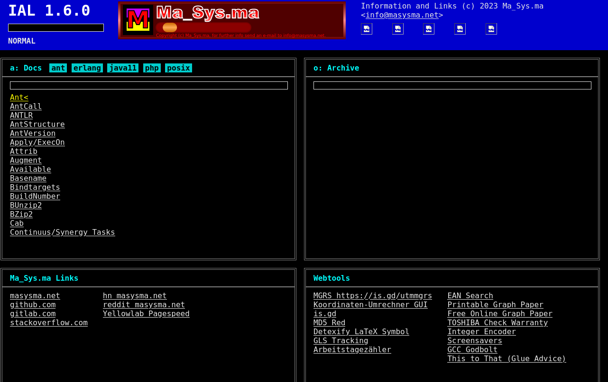

Introduction
============

Ma_Sys.ma _Information and Links_ (IAL) is a set of scripts and an XHTML page
template that allows locally downloading API documentation. This documentation
and other URLs can then be linked from a single home page.

This can be a more structured approach than having tons of bookmarks or
searching documentation online all of the time. Since IAL consists of files
external to the web browser, it can be synchronized across devices and
browsers. It is also possible to serve it through a web server in order to
locally host commonly needed API documentation and links.

IAL consists of two main components:

 1. _XHTML Template_:
    A page template is provided that can be used as a “homepage” for all the
    documentation collected. The page consists of multiple search boxes
    (for Internet and local searches respectively) and “boxes” into which links
    can be placed. These links can point to local documentation or websites.
 2. _Scripts_:
    Scrips are provided for downloading API documentations from the respective
    vendors as HTML files that can be stored locally. Additionally, the scripts
    contain code to extract relevant keywords from the downloaded HTML and
    add links to those keywords to a JSON file (`script.js`) that can then be
    included from the homepage in order to enable a keyword-based search from
    the homepage.

The idea is that these components provide a framework that users can take as
an example that can be customized to fit their own uses.

Getting Started with the Example Content
========================================

If you want to try out what IAL can look and feel like, this section describes
a quick way to set it up to “display something”. If you want to take the most
out of it, consider reading the remainder of the documentation here to find out
what the different parts are supposed to mean.

Additionally, note that all the scripts are unlikely to work on Windows OSes
natively. Consider running them in WSL, Docker or a Linux VM if you are
using Windows.

 1. Clone the `co-artifact` repository and the `bo-ial` repository.

	git clone https://github.com/m7a/bo-ial.git
	git clone https://github.com/m7a/co-maartifact.git
	cd bo-ial

 2. Download some documentation

	./pages_ant.sh      # requires a Debian-based OS, skip if not available
	./pages_erlang.sh
	./pages_java.sh     # requires a Debian-based OS, skip if not available
	./pages_php.sh
	./pages_posix.sh

 3. Instantiate the template

	xmlstarlet tr --xinclude remove_containers.xsl index.xhtml > index_with_includes_resolved.xhtml

 4. Open page `index_with_includes_resolved.xhtml` in a Webbrowser to show the
    example IAL page.

As you can see in the screenshots, the icons are not automatically provided by
the scripts. If you want them to display correctly, you need to download them
from external sources.

The XHTML Template for IAL 1.6
==============================

The XHTML page template can be found in file `index.xhtml` in the repository.
It consists of a page structure, stylesheet and script and contains
XInclude links to files `primary.xml`, `boxes.xml` and `scripts.xml`.

The idea behind these separate files is to separate presentation and contents,
The `index.xhtml` template can be left unmodified for a consistent presentation
and all the contents can be supplied through the three external XML files.
Web browsers do not normally resolve the XInclude directives. Hence in order to
make use of the template, the XInclude links need to be resolved. To do this,
an XML tool like e.g. `xmlstarlet` can be used e.g. as shown under
_Instantiate the template_ above.

Users are of course free to modify the template directly and need not make use
of the XInclude structure proposed here. It is possible to directly include
the contents in the respective sections of the `index.xhtml` by replacing the
XInclude with the content of interest. Staying with the XInclude scheme
simplifies pulling a new `index.xhtml` from the repository later, though.

## `primary.xml` -- Links to Primary Documentation

This file is intended to collect links to “primary” (by choice of the user)
pieces of documentation. The template expects there to be a list of links
with icons, but users are of course free to deviate.

If one were to link Ant, Erlang, Java, PHP and POSIX pages from this
file, the associated `primary.xml` could e.g. look as follows:

~~~xml
<?xml version="1.0" encoding="UTF-8"?>
<!-- primary.xml -->

	
	
	
	
	

~~~

## `boxes.xml` -- Link Collections in Boxes

To be a useful homepage, IAL tries to crunch as many links on the space as
reasonable. To achieve some structure, it allows categorizing the links into
_boxes_. The structuring of the boxes is entirely left to the user. By default,
IAL expects the boxes to contain a title as `<h2>` tag and links in unsorted
lists which are then rendered as two columns by the CSS.

Here is an example which adds two boxes containing some Ma_Sys.ma-related links
and useful webtools respectively:

~~~xml
<?xml version="1.0" encoding="UTF-8"?>
<!-- boxes.xml -->
<masysma:boxes xmlns:masysma="https://masysma.net/32/ial.xhtml"
					xmlns="http://www.w3.org/1999/xhtml">

	<h2>Ma_Sys.ma Links</h2>
	

	<ul>
		<li><a href="https://masysma.net">masysma.net</a></li>
		<li><a href="https://github.com/m7a">github.com</a></li>
		<li><a href="https://gitlab.com/masysma">gitlab.com</a></li>
		<li><a href="https://stackoverflow.com/users/11959417/linux-fan">stackoverflow.com</a></li>
	</ul>
	<ul>
		<li><a href="https://news.ycombinator.com/from?site=masysma.net">hn masysma.net</a></li>
		<li><a href="https://www.reddit.com/search/?q=site%3Amasysma.net">reddit masysma.net</a></li>
		<li><a href="https://yellowlab.tools/result/gh3o7ao6bg">Yellowlab Pagespeed</a></li>
	</ul>

	<h2>Webtools</h2>
	

	<ul>
		<li><a href="https://geographiclib.sourceforge.io/cgi-bin/GeoConvert">MGRS https://is.gd/utmmgrs</a></li>
		<li><a href="https://www.koordinaten-umrechner.de/decimal/51.000000,10.000000?karte=OpenStreetMap&amp;zoom=8">Koordinaten-Umrechner GUI</a></li>
		<li><a href="https://is.gd/index.php">is.gd</a></li>
		<li><a href="https://hashtoolkit.com/">MD5 Red</a></li>
		<li><a href="https://detexify.kirelabs.org/classify.html">Detexify LaTeX Symbol</a></li>
		<li><a href="https://www.gls-pakete.de/sendungsverfolgung">GLS Tracking</a></li>
		<li><a href="https://www.timeanddate.de/datum/arbeitstage-zaehler?d1=01&amp;m1=09&amp;y1=2018&amp;d2=12&amp;m2=10&amp;y2=2018&amp;ti=on&amp;ach=3">Arbeitstagezähler</a></li>
	</ul>
	<ul>
		<li><a href="https://www.ean-search.org/">EAN Search</a></li>
		<li><a href="https://www.blocklayer.com/graph-paper">Printable Graph Paper</a></li>
		<li><a href="https://incompetech.com/graphpaper/weightedgrid/">Free Online Graph Paper</a></li>
		<li><a href="https://myapps.taec.toshiba.com/myapps/admin/jsp/webrma/addRequest1NoLogin.jsp?Action=NEW">TOSHIBA Check Warranty</a></li>
		<li><a href="https://cryptii.com/pipes/Tt2AJQ">Integer Encoder</a></li>
		<li><a href="https://www.bryanbraun.com/after-dark-css/">Screensavers</a></li>
		<li><a href="https://gcc.godbolt.org/">GCC Godbolt</a></li>
		<li><a href="https://www.thistothat.com/index.shtml">This to That (Glue Advice)</a></li>
	</ul>

</masysma:boxes>
~~~

Note the enclosing `masysma:boxes` element which is required as XML does not
support multiple root elements per document. This tag is not used in the
output XHTML as it is removed by the `remove_containers.xsl` stylesheet as
provided in the repository.

## `scripts.xml` -- Providing Database Contents for Keyword Searches

IAL's search feature works by keeping a map of all keys and associated URLs
in memory (in the web browser). JavaScript functions in the template homepage
are provided to process this data in the form of JavaScript Objects (similar to
JSON). The scripts generate `script.js` files which are ready for being included
into the home page by suitable `
	
	
	
	
</masysma:scripts>
~~~

User Interface and Navigation
=============================

The IAL UI concept is a hybrid of VIM-like keybindings and a standard
„clickable” GUI. Links can be clicked just like one expects from any (X)HTML
page.

Additionally, the search input fields can be activated by mouse and a search
text can be entered. In order to open the results, just press [ENTER].

The categories next to the search bars in the boxes can be clicked to toggle
results from this category appearing. By default, all categories are enabled.

The keybindings are as follows:

Key    Meaning
-----  -----------------------------------------------------------------------
ENTER  Open search result (if in a search box) or selected link otherwise
DOWN   Move cursor to the next link (INSERT/navigate in search results)
UP     Move cursor to the previous link (INSERT/navigate in search results)
ESC    Switch to NORMAL mode (i.e. keys get the meaning as per the rows below:
`i`    Focus the “Online”/“Google” search box
`a`    Focus the “Docs” search box
`o`    Focus the “Archive” search box
`h`    Move cursor to the previous box
`j`    Move cursor to the next link
`k`    Move cursor to the previous link
`l`    Move cursor to the next box

If you are using an extension like Vimium, VimFX or such to provide VIM-style
keybindings for the web browser, it may be sensible to disable them for the
IAL page since it implements its own (likely conflicting) keyboard navigation.

The Scripts
===========

The scripts are used to download pieces of information and generate `script.js`
files containing the relevant metadata in a format that IAL can use. The typical
structure of each script is as follows:

 1. Download an archive with the documentation data.
 2. Extract this archive.
 3. From the extracted files, rename and keep only the relevant subdirectories.
 4. Generate a list of entries in `script.js` format from the files.

The first two steps are usually handled by an invocation of
[maartifact(11)](../11/maartifact.xhtml)  which downloads from various sources
and keeps local copies of the original data.

The following scripts are provided in the repository:

Script             Downloads From                        Target Directory
-----------------  ------------------------------------  ----------------
`pages_ada.php`    Debian `ada-reference-manual-2012`    `ada`
`pages_ant.sh`     Debian `ant-doc`                      `ant`
`pages_erlang.sh`  Debian `erlang-doc`                   `erlang`
`pages_jargon.sh`  URL `http://catb.org/jargon/...`      `jargon`
`pages_java.sh`    Debian `openjdk-11-doc`               `java`
`pages_php.sh`     URL `https://www.php.net/distr...`    `php`
`pages_posix.sh`   URL `https://pubs.opengroup.org/...`  `posix`

Archivebox Integration
======================

Archivebox <https://archivebox.io/> is a tool that creates and manages offline
copies of (single) websites. To this end it serves a similar function like IAL,
albeit with a different focus.

Both of the tools can be integrated because the script `pages_archivebox.sql`
(which is a Shell script and an SQL script in a single file!) can be used to
read ArchiveBox' database and create a suitable `script.js` for inclusion into
IAL.

The “Archive” box can then be used to search within the Archivebox links and
[ENTER] leads to the page as captured in Archivebox.

The URL to prepend to Archivebox links is currently hardcoded to
`http://127.0.0.1:7994/archive` but can be changed in `pages_archivebox.sql`
as needed.

Additionally, the integration supports certain tags to be present in the
Archivebox archive and assigns them different “priorities”. This is necessary
since IAL only supports a single category per entry whereas Archivebox entries
can have any number of tags. The tag with the lowest priority is assigned as
category when viewed in IAL (other tags are discarded).

The following shows this as an excerpt from the script.
Smaller numbers mean higher priorities.

~~~sql
-- pages_archivebox.sql lines 26-29
INSERT INTO masysma_tag_priorities (name, prio) VALUES
	('alpha',       10), ('primary',     20), ('fun',         40),
	('swrec',       40), ('gam',         40), ('dcf77',       40),
	('book',        50);
-- ...
~~~

As one can see, the following tags are currently recognized by IAL:

Tag        Description
---------  -------------------------------------------------------
`alpha`    noteworthy primary sources of information
`primary`  less important primary sources of information
`fun`      fun entries
`swrec`    software recommendations
`gam`      entries about games
`dcf77`    entries about clocks
`book`     entries about books or containing the content of a book

Data Format of `script.js`
==========================

The `script.js`-files look as follows:

~~~javascript
ial_add_data([
	{ id: "posix", box: "doc", title: "a64l()", link: "posix/susv4-2018/functions/a64l.html", primary: ["a64l()"], secondary: [] },
	{ id: "posix", box: "doc", title: "abort()", link: "posix/susv4-2018/functions/abort.html", primary: ["abort()"], secondary: [] },
	/* ... */
]);
~~~

I.e.: There is always a call to `ial_add_data` to add the data to IAL's memory.
This function takes a list of objects with the following properties:

Property     Type            Description
---------    --------------  -----------------------------------------------
`id`         String          Specifies the category of the entry.
`box`        `doc` | `abx`   Specifies the box to associate this entry to.
`title`      String          Display name of the entry.
`link`       String          Link to open on pressing [ENTER] on this entry.
`primary`    List\<String>   Strings to match for searching (prefixes).
`secondary`  List\<String>   Alternate strings to match for searching.

The `primary` list is only matched in terms of prefixes whereas the `secondary`
matches appear in the results if the search box contains a substring of the
`secondary` keyword. In the search results, all `primary` results appear first,
followed by all matches from `secondary` entries.

Recommended default values: `box: "doc", secondary: []`.

Example Makefile and Systemd User Service
=========================================

To automatically keep the generated file in sync with the changes made to the
XML files and also to Archivebox databases, a `Makefile` alongside with
Systemd user services is provided in directory `example`.

Create a directory to store your copy of IAL into (e.g.
`/data/main/130_archivebox/ial`) and place all the customized XML files
(`boxes.xml`, `scripts.xml`, `primary.xml`) there alongside a copy of
`index.xhtml` under the name `tpl.xml` and a copy of the `Makefile`.

I.e. in terms of shell commands this might look as follows

	cp example/ialupdate.*               ~/.config/systemd/user
	cp example/Makefile index.xhtml      /data/main/130_archivebox/ial
	cp boxes.xml primary.xml scripts.xml /data/main/130_archivebox/ial

The systemd user services can be installed by copying them to
`~/.config/systemd/user` and then enabling them through systemd, e.g.

	systemctl --user daemon-reload
	systemctl --user enable ialupdate.service
	systemctl --user enable ialupdate.timer

The `ialupdate.service` file needs to be edited to point to the target directory
of the IAL to update:

~~~ini
# ialupdate.service
[Unit]
Description=Ma_Sys.ma IAL Update

[Service]
Type=oneshot
ExecStart=make -C /data/main/130_archivebox/ial

[Install]
WantedBy=default.target
~~~

In the `Makefile`, let `ARCHIVEBOX` point to the location of your Archivebox
installation's directory containing the file `index.sqlite3`.

~~~makefile
# Makefile
MDVL_CI_PHOENIX_ROOT = /data/main/120_mdvl_rr
IAL_SRC              = $(MDVL_CI_PHOENIX_ROOT)/bo-ial
ARCHIVEBOX           = ../data

all: archivebox/script.js index.xhtml

archivebox/script.js: $(ARCHIVEBOX)/index.sqlite3 $(IAL_SRC)/pages_archivebox.sql
	$(IAL_SRC)/pages_archivebox.sql $(ARCHIVEBOX)/index.sqlite3

index.xhtml: tpl.xhtml $(IAL_SRC)/remove_containers.xsl
	xmlstarlet tr --xinclude $(IAL_SRC)/remove_containers.xsl tpl.xhtml \
								> index.xhtml

tpl.xhtml: $(IAL_SRC)/index.xhtml
	cp $< $@
~~~
